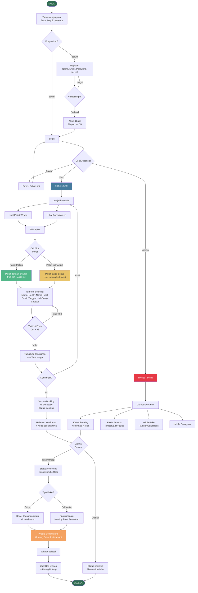
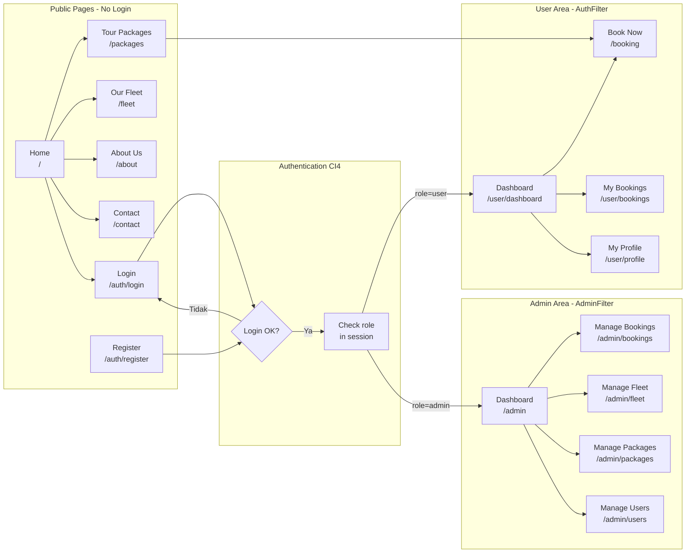
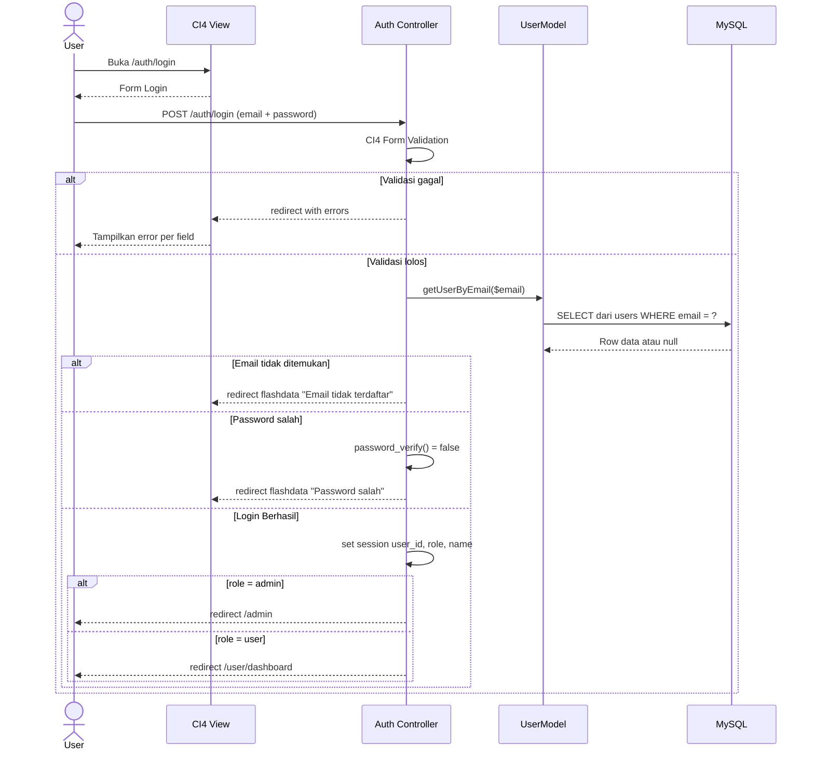
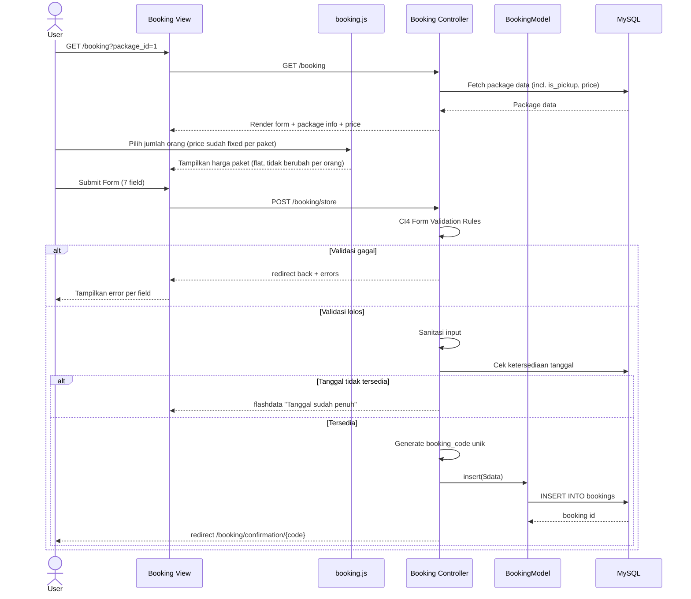
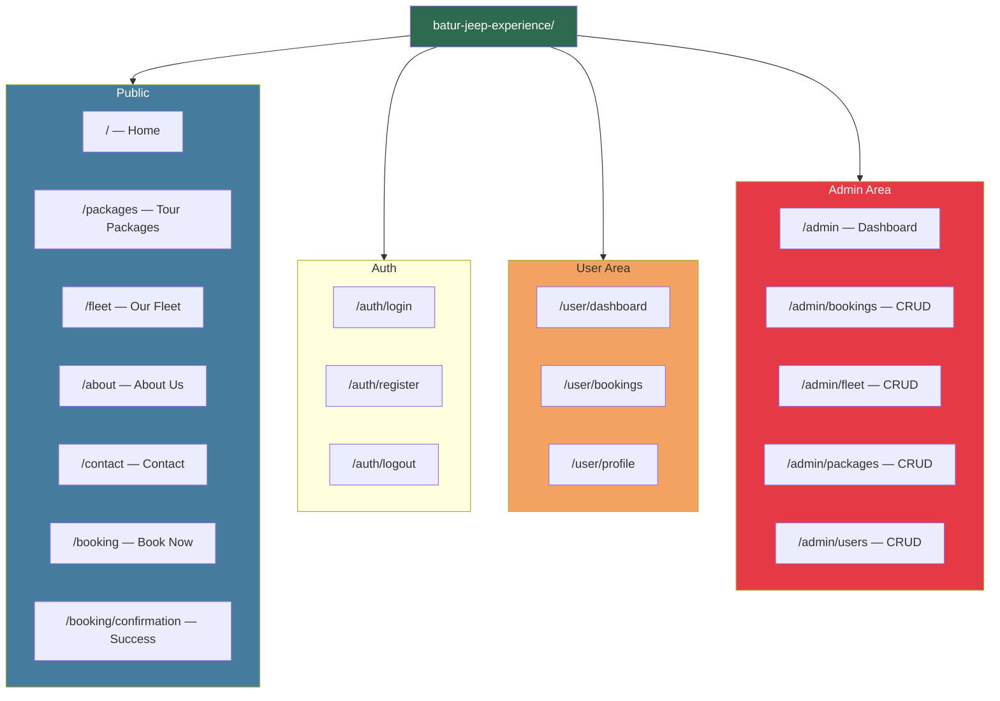

# 🚙 Batur Jeep Experience — Perencanaan Website Penyewaan Jeep
> Dokumen Perencanaan Lengkap · Tim 2 Developer · UTS Pemrograman Web

---

## 📋 Daftar Isi

1. [Ringkasan Proyek](#1-ringkasan-proyek)
2. [Analisis Matriks Penilaian UTS](#2-analisis-matriks-penilaian-uts)
3. [Framework & Tech Stack — CodeIgniter 4](#3-framework--tech-stack--codeigniter-4)
4. [Pembagian Tugas Tim (2 Developer)](#4-pembagian-tugas-tim-2-developer)
5. [Diagram Alur Bisnis](#5-diagram-alur-bisnis)
6. [Alur Lengkap Website](#6-alur-lengkap-website)
7. [Sitemap & Daftar Halaman](#7-sitemap--daftar-halaman)
8. [Desain Database (ERD & SQL Schema)](#8-desain-database-erd--sql-schema)
9. [Wireframe & Deskripsi Halaman](#9-wireframe--deskripsi-halaman)
10. [Timeline Pengerjaan](#10-timeline-pengerjaan)
11. [Checklist Pemenuhan Nilai UTS](#11-checklist-pemenuhan-nilai-uts)

---

## 1. Ringkasan Proyek

| Item | Detail |
|------|--------|
| **Nama Website** | Batur Jeep Experience |
| **Tagline** | *"Conquer Batur, Feel the Adventure"* |
| **Jenis Bisnis** | Penyewaan Jeep & Wisata Offroad Gunung Batur, Kintamani, Bali |
| **Target Pengguna** | Wisatawan lokal & mancanegara, keluarga, pasangan, grup |
| **Tujuan Website** | Booking online, promosi paket wisata, manajemen armada Jeep |
| **Mata Kuliah** | Pemrograman Web (UTS) |
| **Framework** | CodeIgniter 4 (PHP MVC Framework) |
| **Jumlah Developer** | 2 orang |
| **Durasi Pengerjaan** | ±3–4 minggu |

---

## 2. Analisis Matriks Penilaian UTS

Berdasarkan soal UTS Pemrograman Web, berikut pemetaan kriteria penilaian dengan fitur website:

### 📊 Matriks Kriteria & Implementasi

| No | Kriteria Penilaian | Bobot | Implementasi pada Website |
|----|-------------------|-------|--------------------------|
| 1 | **Struktur HTML semantik** | Wajib | Semua View CI4 menggunakan tag HTML5 semantik (`<header>`, `<nav>`, `<main>`, `<section>`, `<footer>`) |
| 2 | **CSS & Tampilan** | Tinggi | Bootstrap 5 + Custom CSS, responsif mobile-first, animasi dan color palette brand |
| 3 | **Form & Validasi Input** | Tinggi | Form booking 7 field (Nama, HP, Hotel, Email, Tanggal, Jumlah Orang, Catatan) — validasi CI4 Form Validation + JS |
| 4 | **Interaktivitas JavaScript** | Tinggi | Kalkulasi harga otomatis, datepicker, galeri interaktif, validasi form real-time |
| 5 | **Database & CRUD** | Tinggi | MySQL: 6 tabel utama — CRUD lengkap via CI4 Model |
| 6 | **Koneksi PHP ke Database** | Wajib | CI4 Database Library (PDO wrapper) — Query Builder pattern |
| 7 | **Keamanan Dasar** | Sedang | CI4 Security (CSRF), prepared queries via QB, session CI4, password_hash |
| 8 | **Responsivitas** | Sedang | Bootstrap grid system, breakpoint 375px / 768px / 1200px |
| 9 | **Navigasi & UX** | Sedang | Navbar CI4 partial view, CTA jelas, breadcrumb, loading states |
| 10 | **Kelengkapan Fitur** | Tinggi | Min. 6 halaman publik + admin panel + sistem booking end-to-end |
| 11 | **Dokumentasi & Kerapian Kode** | Sedang | Docblock PHP, MVC separation, naming convention PSR-12 |
| 12 | **Kreativitas & Inovasi** | Bonus | Tema Batur/Kintamani kuat, foto nyata, testimoni, peta lokasi, paket pickup |

> [!IMPORTANT]
> Fokus utama nilai: **CRUD Database**, **Form Booking + Validasi**, **Tampilan Responsif**, dan **Keamanan (CSRF + Session)**. Implementasikan keempatnya dengan sempurna.

---

## 3. Framework & Tech Stack — CodeIgniter 4

### ✅ Mengapa CodeIgniter 4?

| Aspek | CodeIgniter 4 | Laravel | PHP Native |
|-------|--------------|---------|-----------|
| **Kurva Belajar** | ⭐⭐ Mudah-Sedang | ❌ Cukup Lama | ⭐ Sangat Mudah |
| **Struktur MVC** | ✅ Otomatis terstruktur | ✅ Ya | ❌ Manual |
| **Keamanan Built-in** | ✅ CSRF, Filter, Sanitasi | ✅ Lebih lengkap | ❌ Manual semua |
| **Performa** | ✅ Sangat Ringan | ⚠️ Agak berat | ✅ Paling ringan |
| **Cocok untuk UTS** | ✅ **Terbaik** | ⚠️ Terlalu kompleks | ⚠️ Kurang struktur |
| **Dokumentasi** | ✅ Lengkap & dalam bahasa Inggris sederhana | ✅ Sangat banyak | ✅ Banyak tutorial |
| **Setup di XAMPP** | ✅ Mudah via Composer | ⚠️ Butuh lebih banyak config | ✅ Langsung jalan |

> [!TIP]
> CI4 memberikan **struktur MVC yang jelas** (Model-View-Controller) sehingga Developer A (frontend/View) dan Developer B (backend/Controller+Model) bisa bekerja paralel tanpa saling mengganggu file yang sama.

### 🧰 Tech Stack Lengkap

```
Framework Backend:
├── CodeIgniter 4.x (PHP MVC Framework)
├── PHP 8.x
├── CI4 Query Builder (Database Abstraction)
├── CI4 Form Validation (Server-side Validation)
├── CI4 Session Library (Auth Management)
└── CI4 Security (CSRF Protection)

Frontend:
├── HTML5 (Semantik, di dalam CI4 Views)
├── CSS3 + Bootstrap 5.3
├── JavaScript Vanilla + jQuery (minimal)
├── Font Awesome 6 (Icons)
├── Google Fonts: Poppins + Montserrat
└── Flatpickr.js (Datepicker Booking)

Database:
└── MySQL 8.x (via phpMyAdmin XAMPP)

Tools & Utilities:
├── XAMPP (Local Server: Apache + MySQL)
├── Composer (Dependency Manager CI4)
├── VS Code + PHP Intelephense (Editor)
└── Git + GitHub (Version Control)
```

### 📁 Struktur Folder Proyek (CodeIgniter 4 MVC)

```
batur-jeep-experience/                 <- Root Project (htdocs/batur-jeep)
│
├── app/
│   ├── Config/
│   │   ├── App.php                    # Config base URL, timezone
│   │   ├── Database.php               # Config koneksi MySQL
│   │   ├── Routes.php                 # Definisi semua URL routes
│   │   └── Auth.php                   # Config session & auth
│   │
│   ├── Controllers/
│   │   ├── Home.php                   # Halaman publik: home, about, contact
│   │   ├── Package.php                # Halaman daftar paket wisata
│   │   ├── Fleet.php                  # Halaman daftar armada jeep
│   │   ├── Booking.php                # Form & proses booking
│   │   ├── Auth.php                   # Login, Register, Logout
│   │   ├── User/
│   │   │   └── Dashboard.php          # Dashboard & riwayat user
│   │   └── Admin/
│   │       ├── Dashboard.php          # Dashboard admin
│   │       ├── Booking.php            # CRUD booking (Admin namespace)
│   │       ├── Fleet.php              # CRUD armada jeep (Admin namespace)
│   │       ├── Package.php            # CRUD paket wisata (Admin namespace)
│   │       └── User.php               # Kelola pengguna (Admin namespace)
│   │
│   ├── Models/
│   │   ├── UserModel.php              # Model tabel users
│   │   ├── PackageModel.php           # Model tabel packages
│   │   ├── VehicleModel.php           # Model tabel vehicles
│   │   ├── BookingModel.php           # Model tabel bookings
│   │   └── TestimonialModel.php       # Model tabel testimonials
│   │
│   ├── Views/
│   │   ├── layouts/
│   │   │   ├── main.php               # Layout utama publik
│   │   │   ├── admin.php              # Layout admin panel
│   │   │   └── auth.php               # Layout login/register
│   │   ├── partials/
│   │   │   ├── navbar.php             # Navigasi global
│   │   │   ├── footer.php             # Footer global
│   │   │   └── alerts.php             # Flash messages
│   │   ├── home/
│   │   │   └── index.php              # Halaman Home
│   │   ├── packages/
│   │   │   └── index.php              # Daftar Paket Wisata
│   │   ├── fleet/
│   │   │   └── index.php              # Daftar Armada
│   │   ├── booking/
│   │   │   ├── form.php               # Form Booking
│   │   │   └── confirmation.php       # Konfirmasi berhasil
│   │   ├── auth/
│   │   │   ├── login.php
│   │   │   └── register.php
│   │   ├── user/
│   │   │   ├── dashboard.php
│   │   │   └── bookings.php           # Riwayat booking
│   │   └── admin/
│   │       ├── dashboard.php
│   │       ├── bookings/              # CRUD views booking
│   │       ├── fleet/                 # CRUD views armada
│   │       ├── packages/              # CRUD views paket
│   │       └── users/                 # CRUD views pengguna
│   │
│   └── Filters/
│       ├── AuthFilter.php             # Filter: cek login
│       └── AdminFilter.php            # Filter: cek role admin
│
├── public/
│   ├── index.php                      # Entry point CI4 (jangan diubah)
│   ├── assets/
│   │   ├── css/
│   │   │   ├── style.css              # Custom CSS global
│   │   │   └── admin.css              # CSS admin panel
│   │   ├── js/
│   │   │   ├── main.js                # JS utama publik
│   │   │   └── booking.js             # JS kalkulasi harga booking
│   │   └── images/                    # Foto aset
│   │       ├── jeep/                  # Foto armada
│   │       ├── packages/              # Foto paket
│   │       └── logo.png               # Logo brand
│   └── uploads/                       # Upload foto admin
│       ├── fleet/
│       └── packages/
│
├── writable/                          # Cache, logs, sessions (CI4)
├── .env                               # Environment variables (DB credentials)
├── composer.json
└── spark                              # CLI tool CI4
```

---

## 4. Pembagian Tugas Tim (2 Developer)

### 👨‍💻 Developer A — Views (Frontend) & Routes

| Minggu | Task | File CI4 |
|--------|------|----------|
| **Minggu 1** | Setup CI4 via Composer, konfigurasi `.env` & Routes | `app/Config/`, `.env` |
| **Minggu 1** | Buat layout utama + navbar + footer partial | `app/Views/layouts/`, `partials/` |
| **Minggu 2** | View: Home (hero, package preview, testimoni) | `app/Views/home/index.php` |
| **Minggu 2** | View: Daftar Paket & Detail Paket | `app/Views/packages/` |
| **Minggu 3** | View: Fleet (Armada Jeep) + galeri | `app/Views/fleet/` |
| **Minggu 3** | View: About, Contact | Partial views |
| **Minggu 4** | View: Form Booking (7 field) + JS tampilkan harga paket | `app/Views/booking/form.php`, `booking.js` |
| **Minggu 4** | View: Konfirmasi booking, flash messages | `app/Views/booking/confirmation.php` |

### 👨‍💻 Developer B — Controllers, Models & Admin Panel

| Minggu | Task | File CI4 |
|--------|------|----------|
| **Minggu 1** | Design database + SQL schema + seed data | MySQL, `app/Database/Seeds/` |
| **Minggu 1** | Model: UserModel + Auth Controller (Login/Register) | `app/Models/UserModel.php`, `app/Controllers/Auth.php` |
| **Minggu 2** | Model + Controller: Booking (form submit, validasi CI4) | `BookingModel.php`, `Booking.php` |
| **Minggu 2** | Admin: Dashboard + CRUD Booking | `Admin/Booking.php` |
| **Minggu 3** | Admin: CRUD Fleet + CRUD Package | `Admin/Fleet.php`, `Admin/Package.php` |
| **Minggu 3** | Filter Auth & Admin (route protection) | `app/Filters/` |
| **Minggu 4** | Model + Controller: Package, Fleet publik | `PackageModel.php`, `VehicleModel.php` |
| **Minggu 4** | Security hardening, validasi server-side, testing | Semua controller |

> [!NOTE]
> Developer A mengerjakan `app/Views/` dan Developer B mengerjakan `app/Controllers/` + `app/Models/`. Tidak akan ada konflik file karena separation of concerns MVC sudah jelas.

---

## 5. Diagram Alur Bisnis

### 🗺️ Alur Bisnis Lengkap — Batur Jeep Experience



---

## 6. Alur Lengkap Website

### 🌐 Website Flow — Navigation Map



---

### 🔑 Sequence Diagram — Autentikasi CI4



---

### 📋 Sequence Diagram — Proses Booking



---

## 7. Sitemap & Daftar Halaman



---

## 8. Desain Database (ERD & SQL Schema)

### Entity Relationship Diagram

```mermaid
erDiagram
    users {
        BIGINT id PK "AUTO_INCREMENT, unsigned"
        VARCHAR_100 name "NOT NULL"
        VARCHAR_150 email UK "NOT NULL"
        VARCHAR_255 password "NOT NULL, bcrypt"
        VARCHAR_20 phone "NOT NULL"
        ENUM role "user | admin, DEFAULT user"
        TINYINT is_active "DEFAULT 1"
        TIMESTAMP created_at
        TIMESTAMP updated_at
        TIMESTAMP deleted_at "soft delete"
    }

    packages {
        BIGINT id PK
        VARCHAR_100 name "NOT NULL"
        TEXT description
        DECIMAL_10_2 price "NOT NULL — flat rate per booking"
        TINYINT min_persons "DEFAULT 1"
        TINYINT max_persons "DEFAULT 6"
        VARCHAR_50 duration "contoh: 4 Jam"
        TINYINT is_pickup "0=self-arrive, 1=pickup hotel"
        VARCHAR_255 thumbnail
        TINYINT is_active "DEFAULT 1"
        TIMESTAMP created_at
        TIMESTAMP updated_at
        TIMESTAMP deleted_at
    }

    vehicles {
        BIGINT id PK
        VARCHAR_100 name "NOT NULL"
        VARCHAR_20 plate_number UK "NOT NULL"
        TINYINT capacity "NOT NULL"
        VARCHAR_30 color
        TEXT facilities
        VARCHAR_255 photo
        ENUM status "available | rented | maintenance"
        TIMESTAMP created_at
        TIMESTAMP updated_at
        TIMESTAMP deleted_at
    }

    bookings {
        BIGINT id PK
        VARCHAR_30 booking_code UK "BJE-YYYYMMDD-XXXX"
        BIGINT user_id FK
        BIGINT package_id FK
        BIGINT vehicle_id FK "nullable, assigned by admin"
        VARCHAR_100 customer_name "NOT NULL"
        VARCHAR_20 customer_phone "NOT NULL"
        VARCHAR_150 customer_email "NOT NULL"
        VARCHAR_150 hotel_name "nullable, untuk paket pickup"
        DATE tour_date "NOT NULL"
        TINYINT total_persons "NOT NULL"
        DECIMAL_10_2 total_price "NOT NULL"
        TEXT notes "catatan dari user"
        ENUM status "pending|confirmed|rejected|completed|cancelled"
        TEXT rejection_reason "nullable"
        BIGINT confirmed_by FK "admin user id"
        TIMESTAMP confirmed_at "nullable"
        TIMESTAMP created_at
        TIMESTAMP updated_at
        TIMESTAMP deleted_at
    }

    testimonials {
        BIGINT id PK
        BIGINT user_id FK
        BIGINT booking_id FK "1 booking = 1 review"
        TEXT review "NOT NULL"
        TINYINT rating "1–5, NOT NULL"
        TINYINT is_approved "DEFAULT 0"
        TIMESTAMP created_at
        TIMESTAMP updated_at
    }

    users ||--o{ bookings : "melakukan"
    packages ||--o{ bookings : "dipilih dalam"
    vehicles ||--o{ bookings : "digunakan dalam"
    users ||--o{ testimonials : "menulis"
    bookings ||--o| testimonials : "menghasilkan"
```



---

### 🗄️ SQL Schema — Industry Standard, Scalable & Secure

```sql
-- ============================================================
-- DATABASE: batur_jeep_experience
-- Standard: MySQL 8.x, InnoDB, utf8mb4, Best Practice
-- Author  : Tim Developer Batur Jeep Experience
-- Version : 1.0.0
-- ============================================================

CREATE DATABASE IF NOT EXISTS `batur_jeep_experience`
    CHARACTER SET utf8mb4
    COLLATE utf8mb4_unicode_ci;

USE `batur_jeep_experience`;

-- ============================================================
-- TABLE: users
-- Menyimpan data akun pelanggan dan admin
-- ============================================================
CREATE TABLE `users` (
    `id`          BIGINT UNSIGNED NOT NULL AUTO_INCREMENT,
    `name`        VARCHAR(100)    NOT NULL                    COMMENT 'Nama lengkap pengguna',
    `email`       VARCHAR(150)    NOT NULL                    COMMENT 'Email unik, digunakan untuk login',
    `password`    VARCHAR(255)    NOT NULL                    COMMENT 'Bcrypt hash, min cost 10',
    `phone`       VARCHAR(20)     NOT NULL                    COMMENT 'No HP / WhatsApp aktif',
    `role`        ENUM('user', 'admin') NOT NULL DEFAULT 'user' COMMENT 'Hak akses pengguna',
    `is_active`   TINYINT(1)      NOT NULL DEFAULT 1          COMMENT '1=aktif, 0=dinonaktifkan',
    `created_at`  TIMESTAMP       NOT NULL DEFAULT CURRENT_TIMESTAMP,
    `updated_at`  TIMESTAMP       NOT NULL DEFAULT CURRENT_TIMESTAMP ON UPDATE CURRENT_TIMESTAMP,
    `deleted_at`  TIMESTAMP       NULL DEFAULT NULL           COMMENT 'Soft delete — NULL = tidak dihapus',

    PRIMARY KEY (`id`),
    UNIQUE KEY `uq_users_email` (`email`),
    INDEX `idx_users_role` (`role`),
    INDEX `idx_users_is_active` (`is_active`)
) ENGINE=InnoDB
  DEFAULT CHARSET=utf8mb4
  COLLATE=utf8mb4_unicode_ci
  COMMENT='Data akun pelanggan dan administrator';


-- ============================================================
-- TABLE: packages
-- Paket wisata yang ditawarkan (Sunrise, Offroad, Private)
-- ============================================================
CREATE TABLE `packages` (
    `id`          BIGINT UNSIGNED NOT NULL AUTO_INCREMENT,
    `name`        VARCHAR(100)    NOT NULL                    COMMENT 'Nama paket, contoh: Sunrise Batur',
    `description` TEXT            NOT NULL                    COMMENT 'Deskripsi lengkap paket wisata',
    `price`       DECIMAL(12,2)   UNSIGNED NOT NULL           COMMENT 'Harga flat per booking (bukan per orang)',
    `min_persons` TINYINT UNSIGNED NOT NULL DEFAULT 1         COMMENT 'Minimum jumlah orang per booking',
    `max_persons` TINYINT UNSIGNED NOT NULL DEFAULT 6         COMMENT 'Maksimum kapasitas per booking',
    `duration`    VARCHAR(50)     NOT NULL                    COMMENT 'Durasi, contoh: 4 Jam, Full Day',
    `is_pickup`   TINYINT(1)      NOT NULL DEFAULT 0          COMMENT '1=pickup dari hotel, 0=tamu datang ke lokasi',
    `thumbnail`   VARCHAR(255)    NULL DEFAULT NULL           COMMENT 'Path foto thumbnail paket',
    `is_active`   TINYINT(1)      NOT NULL DEFAULT 1          COMMENT '1=aktif ditampilkan, 0=disembunyikan',
    `created_at`  TIMESTAMP       NOT NULL DEFAULT CURRENT_TIMESTAMP,
    `updated_at`  TIMESTAMP       NOT NULL DEFAULT CURRENT_TIMESTAMP ON UPDATE CURRENT_TIMESTAMP,
    `deleted_at`  TIMESTAMP       NULL DEFAULT NULL           COMMENT 'Soft delete',

    PRIMARY KEY (`id`),
    INDEX `idx_packages_is_active` (`is_active`),
    INDEX `idx_packages_is_pickup` (`is_pickup`),
    CONSTRAINT `chk_packages_price`   CHECK (`price` > 0),
    CONSTRAINT `chk_packages_persons` CHECK (`min_persons` <= `max_persons`)
) ENGINE=InnoDB
  DEFAULT CHARSET=utf8mb4
  COLLATE=utf8mb4_unicode_ci
  COMMENT='Daftar paket wisata Jeep — harga flat per booking';


-- ============================================================
-- TABLE: vehicles
-- Armada Jeep yang dimiliki dan dioperasikan
-- ============================================================
CREATE TABLE `vehicles` (
    `id`           BIGINT UNSIGNED NOT NULL AUTO_INCREMENT,
    `name`         VARCHAR(100)    NOT NULL                   COMMENT 'Nama/panggilan armada, contoh: Jeep Batur 01',
    `plate_number` VARCHAR(20)     NOT NULL                   COMMENT 'Nomor polisi kendaraan',
    `capacity`     TINYINT UNSIGNED NOT NULL                  COMMENT 'Kapasitas penumpang (tidak termasuk driver)',
    `color`        VARCHAR(30)     NULL DEFAULT NULL          COMMENT 'Warna kendaraan',
    `facilities`   TEXT            NULL DEFAULT NULL          COMMENT 'Fasilitas, contoh: Rollbar, Safety Belt, P3K',
    `photo`        VARCHAR(255)    NULL DEFAULT NULL          COMMENT 'Path foto kendaraan',
    `status`       ENUM('available', 'rented', 'maintenance') NOT NULL DEFAULT 'available'
                                                             COMMENT 'Status armada saat ini',
    `created_at`   TIMESTAMP       NOT NULL DEFAULT CURRENT_TIMESTAMP,
    `updated_at`   TIMESTAMP       NOT NULL DEFAULT CURRENT_TIMESTAMP ON UPDATE CURRENT_TIMESTAMP,
    `deleted_at`   TIMESTAMP       NULL DEFAULT NULL          COMMENT 'Soft delete',

    PRIMARY KEY (`id`),
    UNIQUE KEY `uq_vehicles_plate` (`plate_number`),
    INDEX `idx_vehicles_status` (`status`)
) ENGINE=InnoDB
  DEFAULT CHARSET=utf8mb4
  COLLATE=utf8mb4_unicode_ci
  COMMENT='Armada kendaraan Jeep yang dimiliki';


-- ============================================================
-- TABLE: bookings
-- Transaksi pemesanan wisata Jeep oleh pelanggan
-- ============================================================
CREATE TABLE `bookings` (
    `id`               BIGINT UNSIGNED NOT NULL AUTO_INCREMENT,
    `booking_code`     VARCHAR(30)     NOT NULL               COMMENT 'Kode unik, format: BJE-20250611-0001',
    `user_id`          BIGINT UNSIGNED NOT NULL               COMMENT 'FK ke users.id — pemesan',
    `package_id`       BIGINT UNSIGNED NOT NULL               COMMENT 'FK ke packages.id — paket dipilih',
    `vehicle_id`       BIGINT UNSIGNED NULL DEFAULT NULL      COMMENT 'FK ke vehicles.id — diisi admin saat konfirmasi',

    -- Data Pemesan (denormalized untuk histori tahan perubahan data user)
    `customer_name`    VARCHAR(100)    NOT NULL               COMMENT 'Nama lengkap pemesan',
    `customer_phone`   VARCHAR(20)     NOT NULL               COMMENT 'No HP / WhatsApp pemesan',
    `customer_email`   VARCHAR(150)    NOT NULL               COMMENT 'Email pemesan',
    `hotel_name`       VARCHAR(150)    NULL DEFAULT NULL      COMMENT 'Nama hotel — diisi jika paket pickup',

    -- Detail Wisata
    `tour_date`        DATE            NOT NULL               COMMENT 'Tanggal pelaksanaan wisata',
    `total_persons`    TINYINT UNSIGNED NOT NULL              COMMENT 'Jumlah orang yang ikut wisata',
    `total_price`      DECIMAL(12,2)   UNSIGNED NOT NULL       COMMENT 'Harga paket saat booking (snapshot dari packages.price)',  
    `notes`            TEXT            NULL DEFAULT NULL      COMMENT 'Catatan tambahan dari pelanggan',

    -- Status & Audit
    `status`           ENUM('pending', 'confirmed', 'rejected', 'completed', 'cancelled')
                                       NOT NULL DEFAULT 'pending' COMMENT 'Status pemrosesan booking',
    `rejection_reason` TEXT            NULL DEFAULT NULL      COMMENT 'Alasan penolakan jika status = rejected',
    `confirmed_by`     BIGINT UNSIGNED NULL DEFAULT NULL      COMMENT 'FK ke users.id — admin yang konfirmasi',
    `confirmed_at`     TIMESTAMP       NULL DEFAULT NULL      COMMENT 'Waktu admin melakukan konfirmasi/penolakan',

    `created_at`       TIMESTAMP       NOT NULL DEFAULT CURRENT_TIMESTAMP,
    `updated_at`       TIMESTAMP       NOT NULL DEFAULT CURRENT_TIMESTAMP ON UPDATE CURRENT_TIMESTAMP,
    `deleted_at`       TIMESTAMP       NULL DEFAULT NULL      COMMENT 'Soft delete',

    PRIMARY KEY (`id`),
    UNIQUE KEY `uq_bookings_code` (`booking_code`),
    INDEX `idx_bookings_user` (`user_id`),
    INDEX `idx_bookings_package` (`package_id`),
    INDEX `idx_bookings_vehicle` (`vehicle_id`),
    INDEX `idx_bookings_status` (`status`),
    INDEX `idx_bookings_tour_date` (`tour_date`),
    INDEX `idx_bookings_created` (`created_at`),

    CONSTRAINT `fk_bookings_user`
        FOREIGN KEY (`user_id`)      REFERENCES `users` (`id`) ON UPDATE CASCADE ON DELETE RESTRICT,
    CONSTRAINT `fk_bookings_package`
        FOREIGN KEY (`package_id`)   REFERENCES `packages` (`id`) ON UPDATE CASCADE ON DELETE RESTRICT,
    CONSTRAINT `fk_bookings_vehicle`
        FOREIGN KEY (`vehicle_id`)   REFERENCES `vehicles` (`id`) ON UPDATE CASCADE ON DELETE SET NULL,
    CONSTRAINT `fk_bookings_confirmed_by`
        FOREIGN KEY (`confirmed_by`) REFERENCES `users` (`id`) ON UPDATE CASCADE ON DELETE SET NULL,

    CONSTRAINT `chk_bookings_price`   CHECK (`total_price` > 0),
    CONSTRAINT `chk_bookings_persons` CHECK (`total_persons` > 0)
) ENGINE=InnoDB
  DEFAULT CHARSET=utf8mb4
  COLLATE=utf8mb4_unicode_ci
  COMMENT='Riwayat transaksi pemesanan paket wisata Jeep';


-- ============================================================
-- TABLE: testimonials
-- Ulasan dan rating dari pelanggan yang sudah selesai wisata
-- ============================================================
CREATE TABLE `testimonials` (
    `id`          BIGINT UNSIGNED NOT NULL AUTO_INCREMENT,
    `user_id`     BIGINT UNSIGNED NOT NULL                    COMMENT 'FK ke users.id — pemberi ulasan',
    `booking_id`  BIGINT UNSIGNED NOT NULL                    COMMENT 'FK ke bookings.id — 1 booking = 1 ulasan',
    `review`      TEXT            NOT NULL                    COMMENT 'Isi ulasan / testimoni',
    `rating`      TINYINT UNSIGNED NOT NULL                   COMMENT 'Rating 1–5 bintang',
    `is_approved` TINYINT(1)      NOT NULL DEFAULT 0          COMMENT '0=pending review admin, 1=tayang di website',
    `created_at`  TIMESTAMP       NOT NULL DEFAULT CURRENT_TIMESTAMP,
    `updated_at`  TIMESTAMP       NOT NULL DEFAULT CURRENT_TIMESTAMP ON UPDATE CURRENT_TIMESTAMP,

    PRIMARY KEY (`id`),
    UNIQUE KEY `uq_testimonials_booking` (`booking_id`)      COMMENT 'Satu booking hanya bisa 1 ulasan',
    INDEX `idx_testimonials_user` (`user_id`),
    INDEX `idx_testimonials_approved` (`is_approved`),

    CONSTRAINT `fk_testimonials_user`
        FOREIGN KEY (`user_id`)    REFERENCES `users` (`id`) ON UPDATE CASCADE ON DELETE CASCADE,
    CONSTRAINT `fk_testimonials_booking`
        FOREIGN KEY (`booking_id`) REFERENCES `bookings` (`id`) ON UPDATE CASCADE ON DELETE CASCADE,
    CONSTRAINT `chk_testimonials_rating` CHECK (`rating` BETWEEN 1 AND 5)
) ENGINE=InnoDB
  DEFAULT CHARSET=utf8mb4
  COLLATE=utf8mb4_unicode_ci
  COMMENT='Ulasan dan rating pelanggan pasca wisata';


-- ============================================================
-- SEED DATA — Data awal untuk development & testing
-- ============================================================

-- Admin default (password: Admin@1234)
INSERT INTO `users` (`name`, `email`, `password`, `phone`, `role`) VALUES
('Administrator', 'admin@baturjeep.com',
 '$2y$10$92IXUNpkjO0rOQ5byMi.Ye4oKoEa3Ro9llC/.og/at2.uheWG/igi',
 '08123456789', 'admin');

-- Paket Wisata (price = flat rate per booking, bukan per orang)
INSERT INTO `packages` (`name`, `description`, `price`, `min_persons`, `max_persons`, `duration`, `is_pickup`) VALUES
('Sunrise Batur',
 'Saksikan matahari terbit spektakuler di Gunung Batur dengan pemandangan Danau Batur yang memukau. Perjalanan dimulai pukul 04.00 WITA.',
 1500000, 2, 6, '4 Jam', 1),

('Offroad Adventure Full Day',
 'Petualangan offroad seharian penuh menyusuri jalur menantang di lereng Gunung Batur. Cocok untuk pecinta adrenalin.',
 2500000, 2, 4, '8 Jam', 1),

('Private Trip Kintamani',
 'Trip privat eksklusif untuk keluarga atau rombongan kecil. Bebas menentukan rute dan jadwal.',
 3500000, 1, 6, '6 Jam', 0),

('Sunset & Caldera View',
 'Nikmati pemandangan kaldera Batur saat matahari terbenam dari titik tertinggi yang bisa dijangkau Jeep.',
 1800000, 2, 6, '3 Jam', 0);

-- Armada Jeep
INSERT INTO `vehicles` (`name`, `plate_number`, `capacity`, `color`, `facilities`, `status`) VALUES
('Jeep Batur 01', 'DK 1234 AB', 4, 'Hijau Army',  'Rollbar, Safety Belt, P3K', 'available'),
('Jeep Batur 02', 'DK 5678 CD', 4, 'Hitam Doff',  'Rollbar, Safety Belt, P3K', 'available'),
('Jeep Batur 03', 'DK 9012 EF', 4, 'Coklat Muda', 'Rollbar, Safety Belt, P3K, USB Charger', 'available');
```

---

### 📌 Catatan Desain Database

| Keputusan | Alasan |
|-----------|--------|
| **`BIGINT UNSIGNED`** untuk PK | Siap menampung miliaran baris, future-proof |
| **`deleted_at` (Soft Delete)** | Data tidak hilang permanen, bisa dipulihkan, audit trail aman |
| **Data pemesan di-denormalize di `bookings`** | Jika user edit profil, data booking lama tetap akurat |
| **`packages.price` = flat rate** | Harga fixed per booking — tidak tergantung jumlah orang, lebih simple |
| **`bookings.total_price` = snapshot harga** | Menyimpan harga saat booking dibuat, tahan terhadap perubahan harga paket di masa depan |
| **`hotel_name` nullable** | Hanya relevan untuk paket `is_pickup = 1` |
| **`confirmed_by` FK ke `users`** | Audit trail: siapa admin yang konfirmasi/tolak booking |
| **`booking_code` format `BJE-YYYYMMDD-XXXX`** | Human-readable, mudah dikomunikasikan ke pelanggan via WA |
| **Tidak ada `jeep_type` di `vehicles`** | Informasi tipe Jeep bisa dideskripsikan di kolom `facilities` atau nama armada |
| **Index pada `status`, `tour_date`** | Query filter paling sering dipakai, wajib di-index |
| **`UNIQUE` pada `testimonials.booking_id`** | Enforce 1 booking = 1 ulasan di level database |
| **`CHECK constraints`** | Validasi data di level DB: harga > 0, rating 1–5, dll |
| **`ON DELETE RESTRICT`** pada booking** | Tidak bisa hapus user/paket yang sudah punya transaksi |

---

## 9. Wireframe & Deskripsi Halaman

### 🏠 Halaman Home (/)

```
+--------------------------------------------------+
|  BATUR JEEP EXPERIENCE           [Login][Daftar] |  <- Navbar sticky
+--------------------------------------------------+
|                                                  |
|  ################################################ |  <- Hero Full Screen
|  #  CONQUER BATUR, FEEL THE ADVENTURE          # |     Video/Foto BG
|  #  Wisata Jeep Offroad Terbaik di Kintamani  # |
|  #                                             # |
|  #  [ PESAN SEKARANG ]   [ LIHAT PAKET ]      # |
|  ################################################ |
|                                                  |
|  [AMAN & TERPERCAYA] [BERPENGALAMAN] [TERJANGKAU]|
+--------------------------------------------------+
|            PAKET WISATA UNGGULAN                 |
|  +--------+  +--------+  +--------+  +--------+ |
|  |Sunrise |  |Offroad |  |Private |  |Sunset  | |
|  |350rb   |  |750rb   |  |1.2jt  |  |450rb   | |
|  |[Pesan] |  |[Pesan] |  |[Pesan] |  |[Pesan] | |
|  +--------+  +--------+  +--------+  +--------+ |
+--------------------------------------------------+
|          ARMADA JEEP KAMI (Galeri)               |
+--------------------------------------------------+
|          TESTIMONI PELANGGAN (bintang 5)         |
+--------------------------------------------------+
|  LOKASI DAN CARA BOOKING [Google Maps Embed]     |
+--------------------------------------------------+
```

### 📋 Form Booking (/booking)

```
+--------------------------------------------------+
|          FORM BOOKING JEEP BATUR                 |
+--------------------------------------------------+
|  Paket Dipilih:   [Sunrise Batur — Rp 1.500.000 ]|  <- Dari query param
|                   [✅ Paket ini menggunakan PICKUP]|  <- Badge info pickup
+--------------------------------------------------+
|  Nama Lengkap  *  [_____________________________] |
|  No HP/WhatsApp*  [_____________________________] |
|  Nama Hotel    *  [_____________] (jika pickup)   |  <- show/hide via JS
|  Email         *  [_____________________________] |
|  Tanggal Wisata*  [📅 Pilih tanggal             ] |
|  Jumlah Orang  *  [ - ] [ 2 ] [ + ]   (2–6 org) |
|  Catatan          [                             ] |
|                   [                             ] |
+--------------------------------------------------+
|  HARGA PAKET:                    Rp 1.500.000   |  <- Flat price dari DB
|  (Harga sudah termasuk semua peserta)           |
+--------------------------------------------------+
|    [ BATALKAN ]       [ KONFIRMASI BOOKING ]     |
+--------------------------------------------------+
```

> [!NOTE]
> Field **Nama Hotel** muncul/hilang secara dinamis menggunakan JavaScript berdasarkan nilai `is_pickup` dari paket yang dipilih. Harga paket bersifat **flat per booking** — ditampilkan langsung dari data paket, tidak dikalikan jumlah orang.

### ⚙️ Dashboard Admin (/admin)

```
+----------+-------------------------------------------+
|  SIDEBAR |   DASHBOARD — BATUR JEEP EXPERIENCE       |
|          +-------------------------------------------+
| Dashboard|  +-------+ +-------+ +-------+ +-------+  |
| Booking  |  |Booking| |Pending| |Konfirm| |Revenue|  |
| Armada   |  | Total |  |  5   |  | 12   |  |15Jt  |  |
| Paket    |  |  17   | |      | |      | |       |  |
| User     |  +-------+ +-------+ +-------+ +-------+  |
|          +-------------------------------------------+
|          |  BOOKING TERBARU (perlu dikonfirmasi)      |
|          |  +--+------+----------+------+----------+  |
| [Logout] |  |# |Kode  |Pelanggan |Paket |Status   |  |
|          |  +--+------+----------+------+----------+  |
|          |  Tombol: [Konfirmasi] [Tolak] [Detail]  |  |
+----------+-------------------------------------------+
```

---

## 10. Timeline Pengerjaan

```mermaid
gantt
    title Timeline Pengerjaan — Batur Jeep Experience (CI4)
    dateFormat  YYYY-MM-DD
    section Perencanaan
    Analisis & ERD Database       :done,    p1, 2025-01-01, 3d
    Setup CI4 + Git + ENV         :done,    p2, after p1, 2d
    Buat Routes & Folder Structure:done,    p3, after p2, 2d

    section Dev A - Views Frontend
    Layout Main + Admin + Auth    :active,  a1, 2025-01-08, 2d
    View Home - Hero, CTA, Paket  :         a2, after a1, 3d
    View Paket & Armada           :         a3, after a2, 3d
    View About & Kontak           :         a4, after a3, 2d
    View Booking Form + JS Kalkulasi:       a5, after a4, 3d
    View Konfirmasi + Flash Msg   :         a6, after a5, 1d

    section Dev B - Controller + Model
    SQL Schema + Seeder Data      :active,  b1, 2025-01-08, 2d
    Auth: Login, Register, Filter :         b2, after b1, 3d
    Booking Controller + Model    :         b3, after b2, 3d
    Admin CRUD: Booking & Armada  :         b4, after b3, 3d
    Admin CRUD: Paket & User      :         b5, after b4, 2d
    CI4 Validation + Security     :         b6, after b5, 2d

    section Testing & Finishing
    Integrasi View+Controller     :         t1, 2025-01-26, 3d
    Bug Fixing & QA               :         t2, after t1, 2d
    Dokumentasi Kode & README     :         t3, after t2, 2d
    Demo & Final Review           :         t4, after t3, 1d
```

### 🗓️ Ringkasan Jadwal

| Minggu | Fokus | Developer A (Views) | Developer B (Backend) |
|--------|-------|---------------------|-----------------------|
| **Minggu 1** | Setup & Fondasi | Layout, Navbar, Footer | DB Schema + Login/Register |
| **Minggu 2** | Halaman Inti | Home, Paket, Armada | Booking Controller, Admin CRUD Booking |
| **Minggu 3** | Fitur Lengkap | About, Kontak, Form Booking | Admin CRUD Paket+Armada, Filter Auth |
| **Minggu 4** | Polish & Testing | JS kalkulasi, Responsif | Validasi CI4, Keamanan, Dokumentasi |

---

## 11. Checklist Pemenuhan Nilai UTS

### ✅ Kriteria Teknis CI4

- [ ] **Struktur MVC** — Controller di `app/Controllers/`, Model di `app/Models/`, View di `app/Views/`
- [ ] **Routes CI4** — Semua URL didefinisikan di `app/Config/Routes.php`
- [ ] **CI4 Form Validation** — Validasi server-side menggunakan `$this->validate([])`
- [ ] **CI4 Query Builder** — Tidak ada query SQL mentah, semua via `$this->db->table()`
- [ ] **CI4 Session** — `$this->session->set()` untuk login, `$this->session->destroy()` untuk logout
- [ ] **CI4 Filters (AuthFilter, AdminFilter)** — Proteksi route `/user/*` dan `/admin/*`
- [ ] **CSRF Protection** — Aktif di `app/Config/Security.php`, form pakai `csrf_field()`
- [ ] **password_hash() + password_verify()** — Untuk autentikasi yang aman
- [ ] **Soft Delete** — `deleted_at` timestamp, Model CI4 pakai `$useSoftDeletes = true`
- [ ] **Prepared Query via Query Builder** — Anti SQL Injection otomatis
- [ ] **htmlspecialchars() / esc()** — Output di View menggunakan `<?= esc($var) ?>`

### ✅ Halaman Minimum

- [ ] `/` — Home (Hero, Package Preview, Fleet, Testimonials, Maps)
- [ ] `/packages` — Daftar paket dari DB (read dari `packages`)
- [ ] `/fleet` — Daftar armada dari DB (read dari `vehicles`)
- [ ] `/booking` — Form 7 field + show/hide Nama Hotel berdasarkan is_pickup, harga flat
- [ ] `/auth/login` & `/auth/register` — Dengan validasi CI4
- [ ] `/admin` — Dashboard statistik + CRUD booking (konfirmasi/tolak)
- [ ] `/user/bookings` — Riwayat booking milik user yang login

### ✅ Kriteria Database

- [ ] 5 tabel terbuat sesuai schema: `users`, `packages`, `vehicles`, `bookings`, `testimonials`
- [ ] Foreign key constraints aktif
- [ ] Soft delete (`deleted_at`) pada tabel utama
- [ ] Seed data (admin, paket, armada) tersedia
- [ ] Index pada kolom yang sering di-query (`status`, `tour_date`, `email`)

### ✅ Kriteria Desain & UX

- [ ] Tema visual Batur/Kintamani yang kuat (warna, foto, tipografi)
- [ ] Responsive di mobile (375px), tablet (768px), desktop (1200px)
- [ ] Animasi hover pada card dan tombol
- [ ] Show/hide field Nama Hotel secara dinamis sesuai paket
- [ ] Kalkulasi harga otomatis real-time di form booking
- [ ] Flash messages untuk sukses/error setelah operasi CRUD

---

## Panduan Warna & Font Brand

### Color Palette — Tema Gunung Batur

```
Primary     : #2D6A4F  — Hijau Hutan (kepercayaan, alam Bali)
Secondary   : #F4A261  — Oranye Sunrise (energi, matahari terbit)
Accent      : #1D3557  — Navy Gelap (profesional, trustworthy)
Background  : #F8F9FA  — Abu Sangat Terang
Text Dark   : #212529  — Hampir Hitam
Success     : #52B788  — Hijau Muda (konfirmasi)
Warning     : #E9C46A  — Kuning Emas (pending)
Danger      : #E63946  — Merah (error, tolak)
```

### Typography

```
Heading  : 'Montserrat', sans-serif   — Bold 700, judul halaman
Body     : 'Poppins', sans-serif      — Regular 400, teks konten
Tagline  : 'Playfair Display', serif  — Italic, tagline hero section
```

---

## Panduan Keamanan CI4 (Wajib Diimplementasikan)

```php
// ✅ Config Database — gunakan .env, JANGAN hardcode
// File: .env
database.default.hostname = localhost
database.default.database = batur_jeep_experience
database.default.username = root
database.default.password =
database.default.DBDriver = MySQLi

// ✅ Query Builder CI4 — anti SQL Injection otomatis
$users = $this->db->table('users')
    ->where('email', $email)
    ->where('deleted_at', null)
    ->get()->getRow();

// ✅ CI4 Form Validation
$rules = [
    'customer_name'  => 'required|min_length[3]|max_length[100]',
    'customer_phone' => 'required|numeric|min_length[10]|max_length[15]',
    'customer_email' => 'required|valid_email',
    'hotel_name'     => 'permit_empty|max_length[150]',
    'tour_date'      => 'required|valid_date[Y-m-d]',
    'total_persons'  => 'required|integer|greater_than[0]',
];
if (!$this->validate($rules)) {
    return redirect()->back()->withInput()->with('errors', $this->validator->getErrors());
}

// ✅ Password hashing
$hash = password_hash($password, PASSWORD_BCRYPT, ['cost' => 12]);
$isValid = password_verify($input, $hash);

// ✅ Output escaping di View (anti XSS)
<?= esc($booking['customer_name']) ?>

// ✅ CSRF di setiap form (otomatis jika aktifkan di config)
<?= csrf_field() ?>

// ✅ AuthFilter — proteksi route
class AuthFilter implements FilterInterface {
    public function before(RequestInterface $request, $arguments = null) {
        if (!session()->get('user_id')) {
            return redirect()->to('/auth/login')->with('error', 'Silakan login terlebih dahulu.');
        }
    }
}
```

---

## Info Bisnis (Untuk Konten Website)

| Info | Detail |
|------|--------|
| **Nama Bisnis** | Batur Jeep Experience |
| **Tagline** | *Conquer Batur, Feel the Adventure* |
| **Lokasi** | Penelokan, Kintamani, Bangli, Bali |
| **WhatsApp** | 0812-xxxx-xxxx |
| **Email** | info@baturjeep.com |
| **Instagram** | @baturjeepexperience |
| **Jam Operasional** | 03.30 – 18.00 WITA |
| **Meeting Point** | Parkir Penelokan, Jalan Raya Kintamani |
| **Pickup Area** | Hotel di Kuta, Seminyak, Ubud, Sanur, Nusa Dua |

---

> **Dokumen ini adalah panduan resmi pengerjaan proyek UTS Pemrograman Web — Batur Jeep Experience.**
> Sesuaikan konten, harga, dan foto dengan data nyata bisnis.
> Framework CodeIgniter 4 dipilih karena keseimbangan antara kemudahan dan profesionalisme struktur MVC.

---

*Dibuat: Juni 2026 · Tim Developer: 2 Orang · Framework: CodeIgniter 4 · Database: MySQL 8 · Server: XAMPP*
